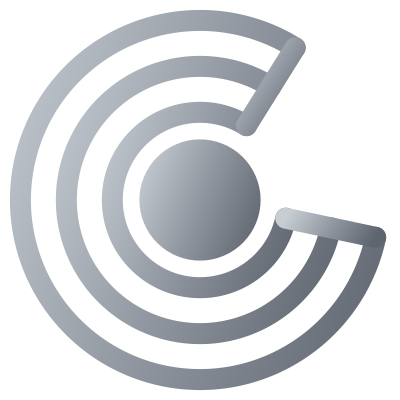
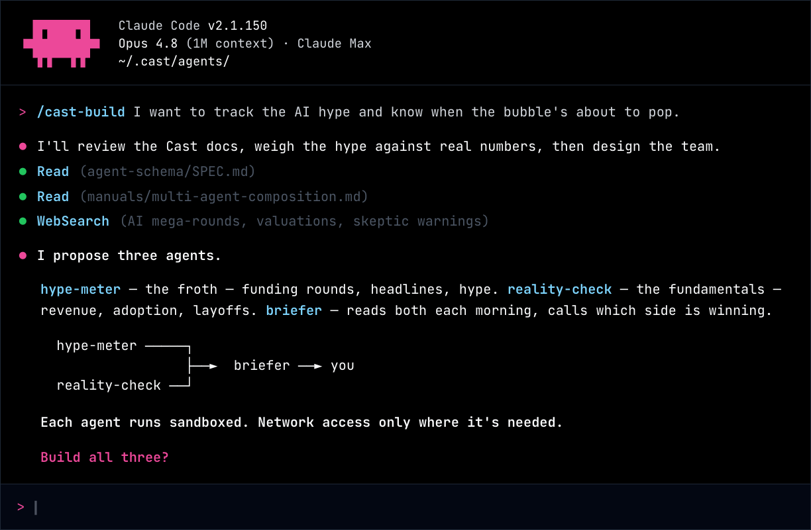

<div align="center">

<a href="https://getcast.dev"></a>

# cast

*Your agent team, on your machine.*

[](https://github.com/yaodub/cast/releases) [](https://github.com/yaodub/cast/tags) [](LICENSE)

[getcast.dev](https://getcast.dev)

</div>

---

Cast is an open-source harness for multi-user, multi-agent systems. Self-hosted, MIT, runs on a Mac Mini.

> ### ❌ Before Cast
> The access rule is a sentence in the prompt. The model can be argued out of it.
> ```
> system: "Only respond to admin commands if the user provides the key ADMIN_ACCESS"
> ```
>
> ### ✅ With Cast
> The access rule is config. The model never sees it, so it cannot leak or override it.
> ```
> # who can reach this agent
> alice@telegram   ioaq   # in, out, admin, query
> *              ----   # everyone else: nothing
> ```

Agent frameworks today assume one developer talking to one agent. That holds up until a team or a household wants to share the same setup. Then the architecture won't bend. Identity, who's allowed to reach what, agents coordinating with each other: bolted on afterward, if at all. Cast is the harness that should have been underneath.

## Two ways to build

An agent is a folder of files, and Cast gives you two ways to write them.

Design, the chat-based builder in the dashboard, scaffolds an agent from a plain-English description. Or you build from Claude Code, where three Cast skills (`/cast-build`, `/cast-refine`, `/cast-debug`) turn an ordinary session into one fluent in Cast's vocabulary and land every change through your review. Both edit the same files under `~/.cast/agents/`, so you can start in one and finish in the other.

<div align="center">



</div>

## Run it

```bash
git clone https://github.com/yaodub/cast.git
cd cast
npm i -g pnpm
pnpm start
```

`pnpm start` installs, builds, builds the agent container image (~2 min the first time), and boots the server. You'll need a container runtime (Apple Container on macOS, Docker on Linux/WSL2), Node 20+, and a Claude credential, either an Anthropic API key or a Claude.ai token.

When it's up, your browser opens to the dashboard at `http://localhost:5051/admin/`.

## First run

The server starts empty. With no agents yet, the dashboard docks Design and asks what you want to build. Describe it in plain English, like "an agent that reads my morning email and flags what's worth a reply," and Design scaffolds it for you, as files (the same files you'd edit from Claude Code). Configure wires in your model and secrets, you flip it live, then you let in the people you trust (their first message waits for your approval), and each of them gets their own private conversation with the same agent, over Slack, Telegram, or the web.

## What's in here

Cast is the server, and that's `packages/cast/`. Agents aren't code. They're folders, and they live under `~/.cast/agents/<name>/` by default (point `CAST_AGENTS_DIR` elsewhere if you want). Extensions like email, calendar, web-fetch, and whatsapp are the `packages/ext-*` packages. The site and all the docs live in `apps/site/`.

Architecture, worked examples, and the design docs are at [getcast.dev](https://getcast.dev).

## Developer alpha

This is a developer alpha, so expect rough edges. The in-browser build consoles (the chat-to-build flow) are a preview: they work, but they're the newest and least settled part. The harness underneath is the part I'd stand behind. That's containment, identity, routing, the access control between agents.

## License

MIT. Issues and PRs welcome. See [CONTRIBUTING.md](CONTRIBUTING.md).
