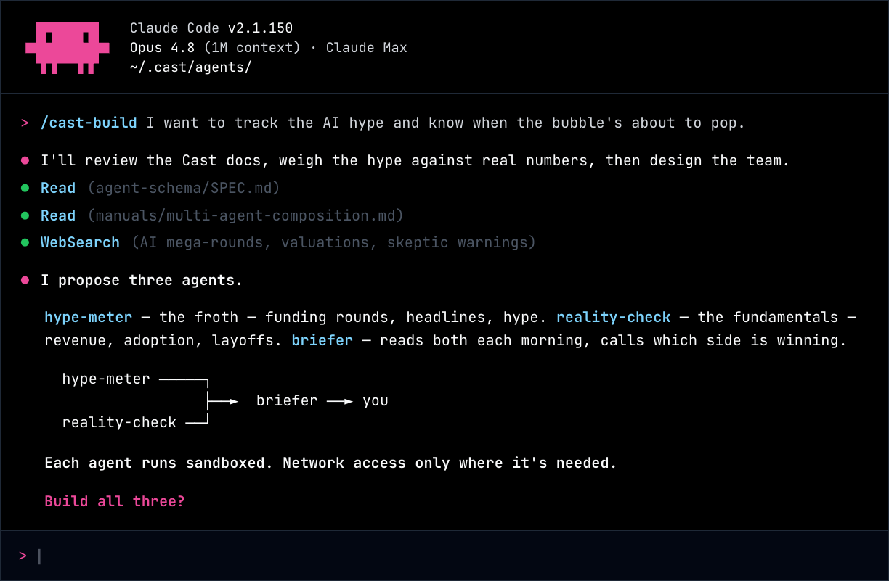

<div align="center">

<a href="https://getcast.dev"></a>

# cast

*Agents that work for you.*

[](https://github.com/yaodub/cast/releases) [](https://github.com/yaodub/cast/tags) [](LICENSE)

[getcast.dev](https://getcast.dev)

</div>

---

Cast runs a small team of AI agents on your own machine. An agent is a folder, and you write its job in plain English.

Each agent runs in a container whose network only reaches the model provider and any domains you whitelist. Its only way in or out is code running outside the container. That code gives the agent a fixed set of known actions. Every message reaching the agent is identity-checked. Service credentials never enter the container.

Cast is designed for agents doing standing work, and to be secure enough to work with real accounts.

```text
~/.cast/agents/
├── mailhand/   "Read my inbox at 7. Flag what needs me, draft the routine replies."
├── repowatch/  "Watch my repos. Log what changed and why, tell me when CI's been red for an hour."
└── household/  "Run the family calendar and the school emails. Anyone in the house can message you."
```

## Run it

```bash
git clone https://github.com/yaodub/cast.git
cd cast
npm i -g pnpm
pnpm start
```

`pnpm start` installs, builds, builds the agent container image (~2 min the first time), and boots the server. You'll need a container runtime (Apple Container on macOS, Docker on Linux/WSL2), Node 20+, and a Claude credential, either an Anthropic API key or a Claude.ai token.

When it's up, your browser opens to the dashboard at `http://localhost:5051/admin/`. The server starts empty. Describe what you want in plain English, like "an agent that reads my morning email and flags what's worth a reply," and the Design console scaffolds it as files. Wire in your model and secrets, then turn it on. When you're ready, let in the people you trust: each gets their own private conversation with the same agent, and their first message waits for your approval.

## How access is enforced

Everything an agent receives, and everything it does, passes through checks you configured:

| | |
|---|---|
| **What it can touch** | An explicit mount table per agent. The agent can write to its memory. Its instructions are mounted read-only. |
| **Where it can send** | Web, email, and calendar actions run as code outside the container, with per-action approvals. |
| **Who it answers to** | Every message is identity-verified at the server before the agent sees it. You set access in config. |
| **Who it can ask** | Agents can query each other only where you granted it, per direction, per channel. |

The model sees only what an agent reads to do its job.

## Problems this solves

**Giving an agent access to real accounts safely.** Instructions in a prompt are not a limit. Cast enforces limits in code outside the container, before the agent runs. A mistake or a hostile message cannot give the agent access you did not grant.

**More than one person, and more than one agent.** Cast separates the person running the server from the people the agent serves: each gets their own conversation, permissions, and history, and cannot see anyone else's. Agents reach each other through the same permission system.

**Work that starts without being asked.** Agents wake on a schedule, or when something arrives in an account you connected. You create a watch by asking for it in conversation. It belongs to whoever asked, and fires into their conversation under their permissions. Creating one takes an approval, and you can list and revoke them at any time.

## Two ways to build

Design, the chat-based builder in the dashboard, scaffolds an agent from a plain-English description. Or you build from Claude Code, where three Cast skills (`/cast-build`, `/cast-refine`, `/cast-debug`) load Cast's file formats and workflows into an ordinary session, with every change landing through your review. Both edit the same files under `~/.cast/agents/`, so you can start in one and finish in the other.

<div align="center">



</div>

## What's in here

Cast is the server, and that's `packages/cast/`. Agents aren't code. They're folders, and they live under `~/.cast/agents/<name>/` by default (point `CAST_AGENTS_DIR` elsewhere if you want). The code that reaches email, calendar, the web, and whatsapp lives in `packages/ext-*`. The site and all the docs live in `apps/site/`.

Architecture, worked examples, and the design docs are at [getcast.dev](https://getcast.dev).

## Upgrading

Already running Cast? [UPGRADING.md](UPGRADING.md) has the procedure. Each release ships a migration README under `scripts/migrations/`, including the releases where there's nothing to run.

## Developer alpha

This is a developer alpha, so expect rough edges. The in-browser build consoles (the chat-to-build flow) are a preview: they work, but they're the newest and least settled part. The infrastructure underneath is the part I'd stand behind: containment, identity, routing, and the access control between agents.

## License

MIT. Issues and PRs welcome. See [CONTRIBUTING.md](CONTRIBUTING.md).
